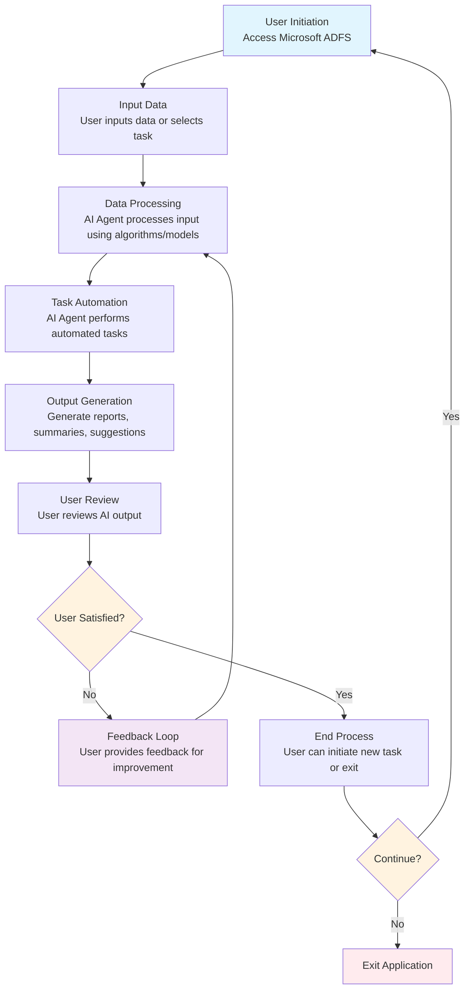
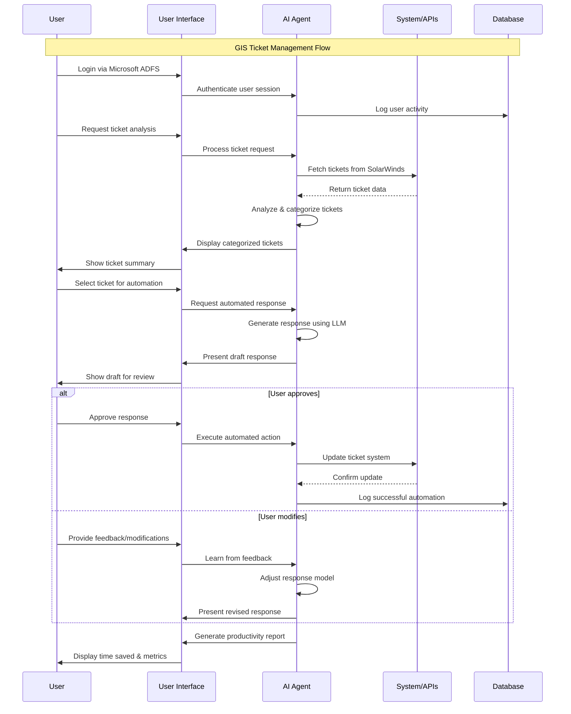
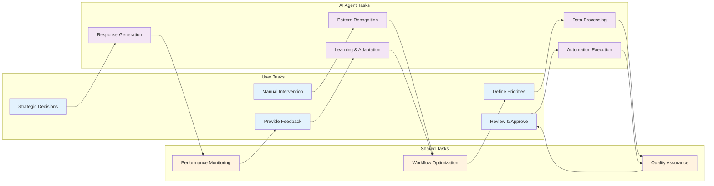

# Workflow Mermaid Diagram

## AI Agent/Application Workflow



## Workflow Description

This mermaid diagram illustrates the complete workflow of the AI Agent/Application:

1. **User Initiation**: User accesses the system through Microsoft ADFS authentication
2. **Input Data**: User provides data or selects tasks to automate
3. **Data Processing**: AI Agent processes the input using predefined algorithms and models
4. **Task Automation**: AI Agent performs automated tasks based on processed data
5. **Output Generation**: System generates results including reports, summaries, and suggestions
6. **User Review**: User reviews the generated output
7. **Feedback Loop**: If user is not satisfied, feedback is provided to improve future interactions
8. **End Process**: Workflow concludes with option to start new task or exit

The diagram shows decision points where users can provide feedback and choose to continue with new tasks or exit the application.

## AI Agent & User Task Interaction Flow



## Task Collaboration Matrix



## Wireframe Representation

```
┌─────────────────────────────────────────────────────────────────────────────────┐
│                          GIS Workflow AI Agent                                 │
├─────────────────────────────────────────────────────────────────────────────────┤
│ User: John Doe                                    [Settings] [Help] [Logout]   │
└─────────────────────────────────────────────────────────────────────────────────┘

┌─────────────────────────────────────────────────────────────────────────────────┐
│                             Dashboard                                           │
├─────────────────────────────────────────────────────────────────────────────────┤
│                                                                                 │
│  ┌─────────────────────┐    ┌─────────────────────┐    ┌─────────────────────┐  │
│  │   Ticket Queue      │    │   AI Suggestions    │    │   Productivity      │  │
│  │   ┌─────────────┐   │    │   ┌─────────────┐   │    │   ┌─────────────┐   │  │
│  │   │ New: 12     │   │    │   │ Auto-solve: │   │    │   │ Time Saved: │   │  │
│  │   │ In Progress │   │    │   │ 8 tickets   │   │    │   │ 4.5 hours   │   │  │
│  │   │ Pending: 5  │   │    │   │ Need Review:│   │    │   │ Tasks Done: │   │  │
│  │   │ Resolved: 23│   │    │   │ 4 tickets   │   │    │   │ 15 today    │   │  │
│  │   └─────────────┘   │    │   └─────────────┘   │    │   └─────────────┘   │  │
│  └─────────────────────┘    └─────────────────────┘    └─────────────────────┘  │
│                                                                                 │
└─────────────────────────────────────────────────────────────────────────────────┘

┌─────────────────────────────────────────────────────────────────────────────────┐
│                        Ticket Analysis Interface                               │
├─────────────────────────────────────────────────────────────────────────────────┤
│                                                                                 │
│  ┌─────────────────────────────────────────────────────────────────────────────┐ │
│  │ Ticket #12345 - GIS Layer Not Loading                                      │ │
│  │ Status: New          Priority: High          Category: Technical Support   │ │
│  │                                                                             │ │
│  │ AI Analysis:                                                                │ │
│  │ • Issue Type: Layer rendering problem                                       │ │
│  │ • Confidence: 85%                                                          │ │
│  │ • Similar Cases: 3 resolved in last 30 days                               │ │
│  │ • Estimated Resolution Time: 15 minutes                                    │ │
│  │                                                                             │ │
│  │ Suggested Actions:                                                          │ │
│  │ 1. Check service status                                                     │ │
│  │ 2. Verify user permissions                                                  │ │
│  │ 3. Clear browser cache                                                      │ │
│  │                                                                             │ │
│  │ [Auto-Execute] [Modify Response] [Manual Handle] [Mark for Review]         │ │
│  └─────────────────────────────────────────────────────────────────────────────┘ │
│                                                                                 │
│  ┌─────────────────────────────────────────────────────────────────────────────┐ │
│  │ AI Generated Response (Draft):                                              │ │
│  │                                                                             │ │
│  │ Dear [User Name],                                                           │ │
│  │                                                                             │ │
│  │ Thank you for reporting the GIS layer loading issue. I've analyzed your    │ │
│  │ request and identified the most likely cause. Please try the following:    │ │
│  │                                                                             │ │
│  │ 1. Clear your browser cache and cookies                                    │ │
│  │ 2. Check if you have the required permissions for this layer              │ │
│  │ 3. Try accessing the layer from a different browser                       │ │
│  │                                                                             │ │
│  │ If the issue persists, please let me know and I'll escalate this to our   │ │
│  │ technical team for further investigation.                                   │ │
│  │                                                                             │ │
│  │ Best regards,                                                               │ │
│  │ GIS Support Team                                                            │ │
│  │                                                                             │ │
│  │ [Send Response] [Edit Response] [Request Human Review] [Save Draft]        │ │
│  └─────────────────────────────────────────────────────────────────────────────┘ │
│                                                                                 │
└─────────────────────────────────────────────────────────────────────────────────┘

┌─────────────────────────────────────────────────────────────────────────────────┐
│                          Feedback & Learning Panel                             │
├─────────────────────────────────────────────────────────────────────────────────┤
│                                                                                 │
│  User Feedback on AI Performance:                                              │
│  ┌─────────────────────────────────────────────────────────────────────────────┐ │
│  │ Response Quality: ⭐⭐⭐⭐⭐                                                    │ │
│  │ Accuracy: ⭐⭐⭐⭐⭐                                                          │ │
│  │ Time Saved: ⭐⭐⭐⭐⭐                                                        │ │
│  │                                                                             │ │
│  │ Comments: "The AI correctly identified the issue and provided a clear      │ │
│  │ solution. Response was professional and saved me 20 minutes of analysis."  │ │
│  │                                                                             │ │
│  │ [Submit Feedback] [Save for Later] [Report Issue]                          │ │
│  └─────────────────────────────────────────────────────────────────────────────┘ │
│                                                                                 │
└─────────────────────────────────────────────────────────────────────────────────┘
```

## Flow Description

### AI Agent & User Task Interaction

This sequence diagram shows the detailed interaction between the user and AI agent during a typical GIS ticket management workflow:

1. **Authentication Phase**: User logs in through Microsoft ADFS with AI agent handling session management
2. **Data Analysis Phase**: AI agent fetches and analyzes tickets from SolarWinds API
3. **Response Generation Phase**: AI creates draft responses using LLM capabilities
4. **Human-in-the-Loop Phase**: User reviews and can approve, modify, or reject AI suggestions
5. **Learning Phase**: AI agent learns from user feedback to improve future responses

### Task Collaboration Matrix

The collaboration matrix illustrates how tasks are distributed between the user and AI agent:

- **User Tasks**: Strategic decisions, quality approval, feedback provision
- **AI Agent Tasks**: Data processing, pattern recognition, automated execution
- **Shared Tasks**: Quality assurance, workflow optimization, performance monitoring

### Wireframe Interface

The wireframe shows a practical interface design featuring:
- **Dashboard**: Overview of ticket queue, AI suggestions, and productivity metrics
- **Ticket Analysis**: AI-powered analysis with confidence scores and suggested actions
- **Response Generation**: Draft responses with editing capabilities
- **Feedback System**: User feedback collection for continuous AI improvement

This design ensures seamless collaboration between human expertise and AI automation, maintaining user control while maximizing efficiency.

## Complex System Architecture Diagram

```mermaid
graph TD
    subgraph "Authentication Layer"
        A1[Microsoft ADFS]
        A2[Azure AD]
        A3[Session Management]
        A4[User Permissions]
    end
    
    subgraph "User Interface Layer"
        B1[Web Dashboard]
        B2[Mobile App]
        B3[Desktop Client]
        B4[API Interface]
    end
    
    subgraph "AI Agent Core"
        C1[Request Handler]
        C2[Task Orchestrator]
        C3[Decision Engine]
        C4[Learning Module]
        C5[Response Generator]
        C6[Quality Assurance]
    end
    
    subgraph "Data Processing Layer"
        D1[Data Ingestion]
        D2[ETL Pipeline]
        D3[Data Validation]
        D4[Pattern Recognition]
        D5[Classification Engine]
        D6[Sentiment Analysis]
    end
    
    subgraph "Integration Services"
        E1[SolarWinds API]
        E2[ArcGIS Services]
        E3[Microsoft Graph]
        E4[Email Services]
        E5[Teams Integration]
        E6[SharePoint Connector]
    end
    
    subgraph "AI/ML Services"
        F1[Natural Language Processing]
        F2[Machine Learning Models]
        F3[Computer Vision]
        F4[Predictive Analytics]
        F5[Recommendation Engine]
        F6[Anomaly Detection]
    end
    
    subgraph "Data Storage"
        G1[User Database]
        G2[Ticket Database]
        G3[Knowledge Base]
        G4[Analytics Store]
        G5[Cache Layer]
        G6[Audit Logs]
    end
    
    subgraph "Monitoring & Analytics"
        H1[Performance Metrics]
        H2[User Analytics]
        H3[System Health]
        H4[Error Tracking]
        H5[Usage Reports]
        H6[Feedback Analysis]
    end
    
    %% Authentication connections
    A1 --> A3
    A2 --> A3
    A3 --> A4
    
    %% UI Layer connections
    B1 --> C1
    B2 --> C1
    B3 --> C1
    B4 --> C1
    
    %% AI Agent Core connections
    C1 --> C2
    C2 --> C3
    C3 --> C4
    C3 --> C5
    C5 --> C6
    C4 --> C5
    
    %% Data Processing connections
    D1 --> D2
    D2 --> D3
    D3 --> D4
    D4 --> D5
    D5 --> D6
    
    %% Integration connections
    E1 --> D1
    E2 --> D1
    E3 --> D1
    E4 --> C5
    E5 --> C5
    E6 --> D1
    
    %% AI/ML connections
    F1 --> C3
    F2 --> C3
    F3 --> D4
    F4 --> C3
    F5 --> C5
    F6 --> H3
    
    %% Storage connections
    D6 --> G1
    C6 --> G2
    F5 --> G3
    H1 --> G4
    C1 --> G5
    C2 --> G6
    
    %% Monitoring connections
    C6 --> H1
    B1 --> H2
    G5 --> H3
    C1 --> H4
    H2 --> H5
    C4 --> H6
    
    %% Cross-layer connections
    A4 --> B1
    C2 --> D1
    C3 --> F1
    C5 --> E4
    G3 --> F2
    H6 --> C4
    
    %% Styling
    classDef authStyle fill:#e3f2fd,stroke:#1976d2,stroke-width:2px
    classDef uiStyle fill:#f3e5f5,stroke:#7b1fa2,stroke-width:2px
    classDef aiStyle fill:#fff3e0,stroke:#f57c00,stroke-width:2px
    classDef dataStyle fill:#e8f5e8,stroke:#388e3c,stroke-width:2px
    classDef integStyle fill:#fce4ec,stroke:#c2185b,stroke-width:2px
    classDef mlStyle fill:#f1f8e9,stroke:#689f38,stroke-width:2px
    classDef storageStyle fill:#e0f2f1,stroke:#00796b,stroke-width:2px
    classDef monitorStyle fill:#fff8e1,stroke:#fbc02d,stroke-width:2px
    
    class A1,A2,A3,A4 authStyle
    class B1,B2,B3,B4 uiStyle
    class C1,C2,C3,C4,C5,C6 aiStyle
    class D1,D2,D3,D4,D5,D6 dataStyle
    class E1,E2,E3,E4,E5,E6 integStyle
    class F1,F2,F3,F4,F5,F6 mlStyle
    class G1,G2,G3,G4,G5,G6 storageStyle
    class H1,H2,H3,H4,H5,H6 monitorStyle
```



## Export Instructions

To convert this diagram to JPEG format:

### Method 1: Using VS Code
1. Install the "Mermaid Preview" extension
2. Open this file in VS Code
3. Right-click on the diagram and select "Export as Image"
4. Choose JPEG format

### Method 2: Using Online Tools
1. Copy the mermaid code above
2. Go to https://mermaid.live/
3. Paste the code
4. Click "Download PNG/SVG" then convert to JPEG

### Method 3: Using Command Line
```bash
# Install mermaid-cli
npm install -g @mermaid-js/mermaid-cli

# Convert to image
mmdc -i workflow-mermaid-diagram.md -o diagram.jpeg -t dark
```

## Architecture Overview

This complex system architecture diagram shows:

- **8 Major System Layers**: Each representing a different aspect of the AI agent system
- **48 Individual Components**: Detailed breakdown of system functionality
- **Multiple Integration Points**: Showing how different layers interact
- **Color-Coded Layers**: Visual distinction between different system aspects
- **Hierarchical Structure**: Similar to the uploaded image with multiple levels and connections

The diagram can be exported as a high-resolution JPEG using any of the methods above.